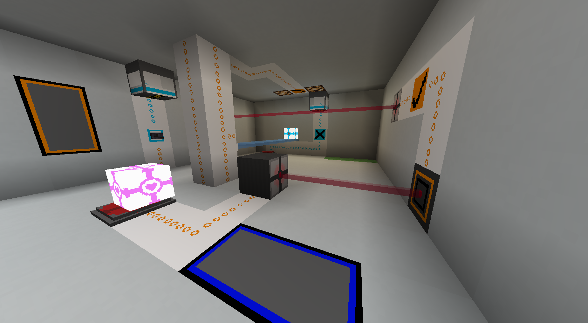
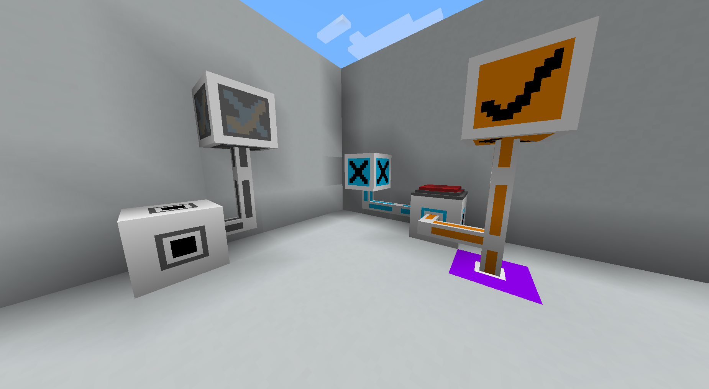
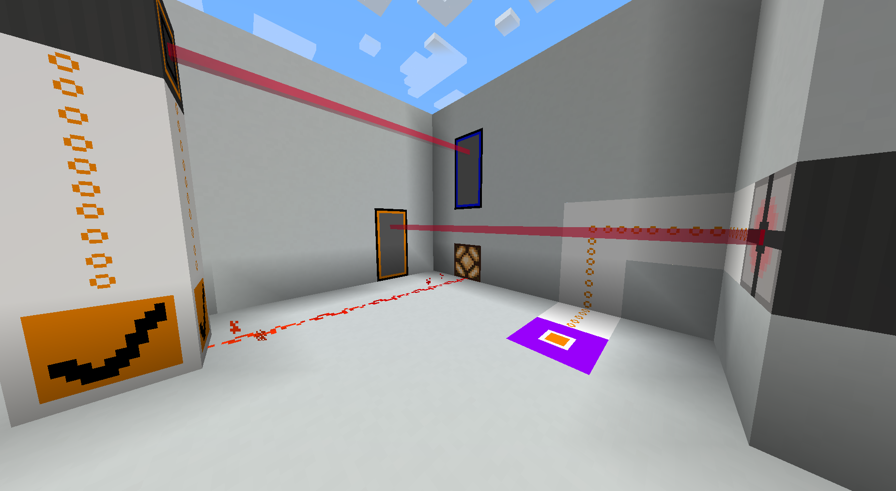
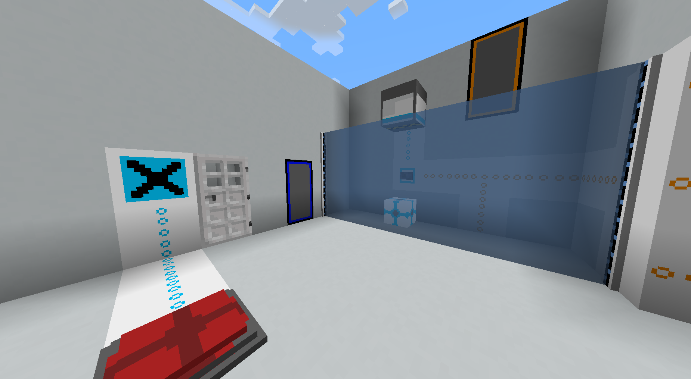

Portal Gun Mod for Forge 1.20.2
--------------------------------
I realised that there aren't really Portal mods for newer versions of the game on Forge, so I decided to make my own :)

Features
--------------------------------
Features include but are not limited to:
 - Portal Gun
 - Emancipation Grid
 - Weighted Storage & Companion Cubes
 - Pressure Button
 - Lasers
 - Hard Light Bridge
 - Aperturestone (An entire energy system for testing elements, includes redstone I/O and logic gates)

Installation instructions
--------------------------------
No special installation instructions, install it as any other Forge mod: put the .jar file into the mods folder

Screenshots
--------------------------------

